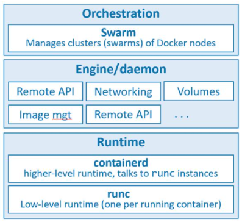

# Docker (The Technology)

## What is Docker

Docker is a containerization tool that is responsible for defining the modern standard of containerization technology.
Its function is to create, manage, and (with use of [Docker Swarm](./Docker_Swarm.md)) orchestrate containers that run within a computer.
A large set of its technologies are built from the open-source project [Moby](https://mobyproject.org/).

## Dockers Components

The Docker Technology comprises three main parts:

* The runtime
* The Daemon (or engine)
* The Orchestrator

The three main components are related thus:

## The Runtime

The

[Read More Here](https://docs.docker.com/get-started/overview/)

__TAGS:__
_#Docker #Container #Dev_Ops #Virtualisation #VM_

__References__ 
_Docker Deep Dive; Nigel Poulton_
